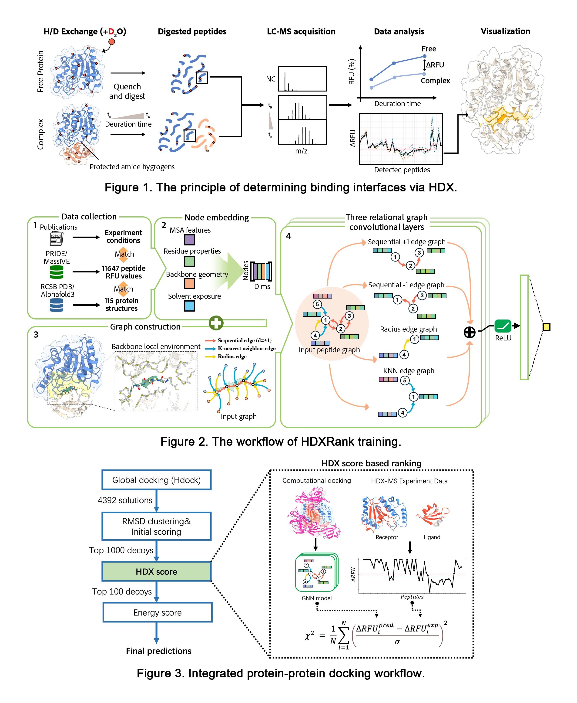

# HDXRank
**HDXRank is an open-source pipeline to apply HDX-MS restraints to protein-protein complex integrative docking.**

## Method overview:

Integrating sparse experimental data into protein docking workflows can significantly improve the accuracy and reliability of complex model predictions. Inspired by advances in graph-based deep learning for protein representation, we presented a docking scoring framework that re-ranks protein-protein complex models based on their alignment with experimentally observed HDX profiles, offering a robust, HDX-informed docking protocol to improve docking accuracy.

## Installation:
clone the repository and Use the `requirements.yml` file to create a Conda environment with all necessary dependencies:
```
git clone https://github.com/SuperChrisW/HDXRank.git
cd HDXRank
conda env create -f ./requirements.yml
conda activate <environment_name>
```

## Quick start

## Citing HDXRank
if you use HDXRank, please cite the paper: 