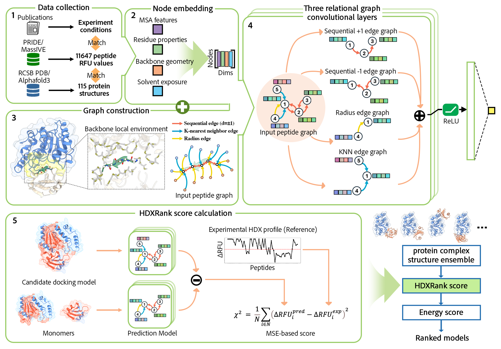

# HDXRank
**HDXRank is an open-source pipeline to apply HDX-MS restraints to protein-protein complex prediction ranking.**

## Method overview:

Integrating sparse experimental data into protein complex modeling workflows can significantly improve the accuracy and reliability of predicted models. Despite the valuable insights that hydrogen-deuterium exchange (HDX) data provide about protein binding interfaces, there is currently no standard protocol for incorporating this information into the complex model selection process. Inspired by advances in graph-based deep learning for protein representation, we utilize it as a backbone for a flexible scoring framework in protein-protein complex model ranking based on their alignment with experimental HDX profiles. It offers a robust, HDX-informed selection protocol with improved prediction accuracy.

## Installation:
clone the repository and Use the `HDXRank_minimum.yml` file to create a Conda environment with all necessary dependencies:
```
git clone https://github.com/SuperChrisW/HDXRank.git
cd HDXRank
conda env create -f ./HDXRank_minimum.yml
conda activate <environment_name>
```

## Preprocessing
* temporailly refers to AI-HDX document(https://github.com/Environmentalpublichealth/AI-HDX/blob/main/Documentations/MSA_embedding.md)

## Start
Three input files are required for HDXRank: protein structure file (.pdb), MSA file (.hhm), HDX-MS file (.xlsx),
HDXRank utilize setting file (.xml) to control the pipeline, basically, HDXRank embed proteins from its pdb file and hhm file,
and construct protein graph from pdb file, then split protein graph into peptide graphs according to HDX-MS file.
With all files prepared, run command:
```bash
python main.py -input ./settings/BatchTable_setting.xml
```

## Citing HDXRank
if you use HDXRank, please cite the paper: 